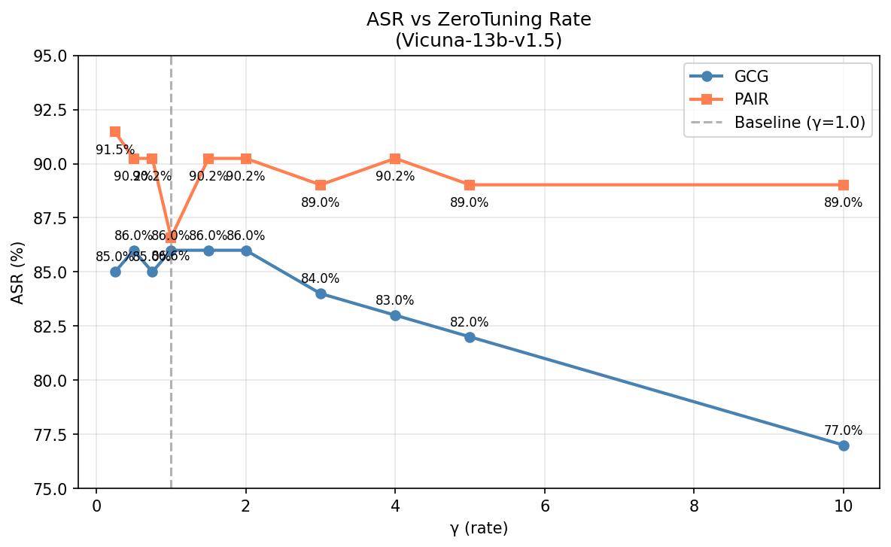
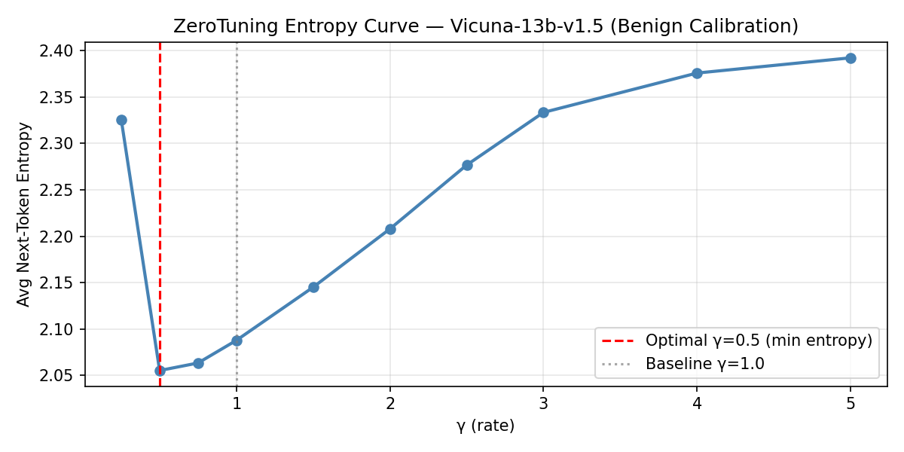
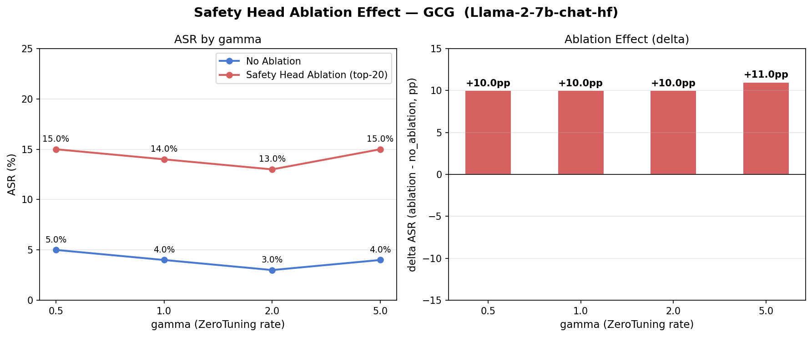
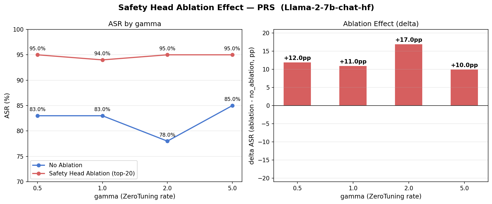
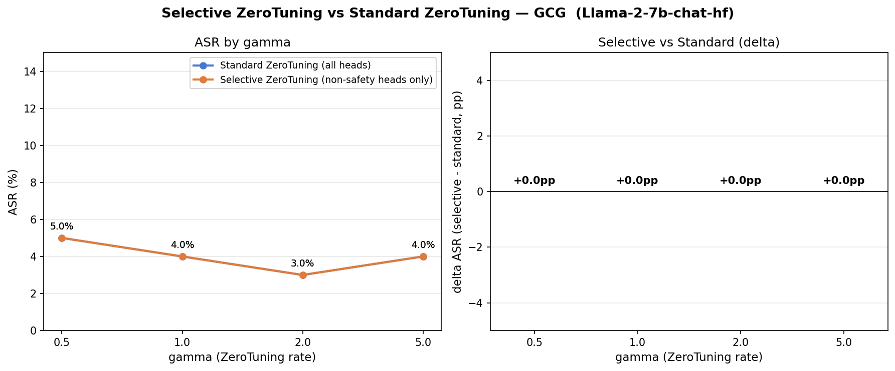
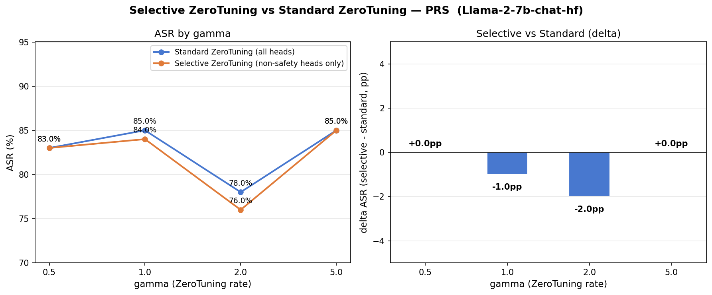
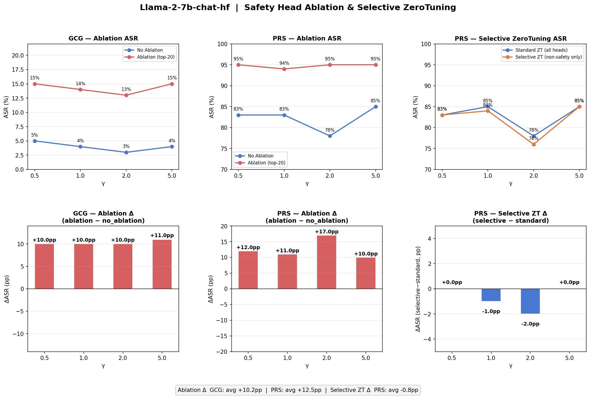

# Jailbreak Robustness via Selective ZeroTuning

**Advanced Machine Learning Course Project (2026-1)**

Reproduces ZeroTuning ([arxiv:2505.11739](https://arxiv.org/abs/2505.11739)) on JailbreakBench and investigates whether selectively excluding safety-critical attention heads from ZeroTuning's γ-scaling can reduce jailbreak vulnerability.

---

## Overview

ZeroTuning scales attention weights toward the BOS token by a factor γ, changing model behavior without any training. This project:

1. **Reproduces** the ZeroTuning ASR sweep on `vicuna-13b-v1.5` (GCG + PAIR, γ ∈ [0.25, 10.0])
2. **Identifies safety heads** in `Llama-2-7b-chat-hf` using the refusal direction method ([arxiv:2508.19697](https://arxiv.org/abs/2508.19697))
3. **Ablates safety heads** to confirm their role in jailbreak defense
4. **Applies Selective ZeroTuning** — γ-scaling on non-safety heads only — and measures ASR change

---

## Experimental Pipeline

```
[1] run_jailbreak.py       — ZeroTuning ASR sweep on vicuna-13b-v1.5
                              γ ∈ {0.25, 0.5, …, 10.0} × GCG(100) + PAIR(82)
                              Judge: Llama-3.3-70B-Instruct-Turbo via Together AI

[2] find_safety_heads.py   — Safety head detection on Llama-2-7b-chat-hf
                              Refusal direction r_l = normalize(mean(h_harmful_l) − mean(h_benign_l))
                              Head score = mean |dot(head_contrib_last_token, r_{l+1})|
                              Output: outputs/safety_heads.json (top-20)

[3] run_ablation.py        — Safety head ablation (zero o_proj weights for top-20 heads)
                              Models: vicuna-13b-v1.5, Llama-2-7b-chat-hf
                              Attacks: GCG, PRS (prompt_with_random_search)
                              γ ∈ {0.5, 1.0, 2.0, 5.0}

[4] run_selective_zt.py    — Selective ZeroTuning: γ applied to non-safety heads only
                              standard_zt: all 1024 heads scaled
                              selective_zt: 1004 non-safety heads scaled, 20 safety heads at γ=1.0
```

---

## Results

### 1. ZeroTuning ASR Sweep (vicuna-13b-v1.5)

| γ | GCG ASR | PAIR ASR | GCG Δ | PAIR Δ |
|---|---|---|---|---|
| 0.25 | 85.0% | 91.5% | −1pp | +4.9pp |
| 0.50 | 86.0% | 90.2% | ±0pp | +3.6pp |
| **1.00 (baseline)** | **86.0%** | **86.6%** | — | — |
| 2.00 | 86.0% | 90.2% | ±0pp | +3.6pp |
| 5.00 | 82.0% | 89.0% | −4pp | +2.4pp |
| 10.00 | 77.0% | 89.0% | −9pp | +2.4pp |

GCG ASR is flat across γ=0.5–2.0 (logit saturation from gradient-optimized suffix). PAIR is more sensitive — any perturbation from γ=1.0, in either direction, slightly increases ASR, suggesting RLHF safety calibration is tightly tuned to γ=1.0.




### 2. Safety Head Ablation (Llama-2-7b-chat-hf)

Top-20 safety heads concentrated in mid-to-late layers (12–39), with layer 18 head 27 and layer 38 head 8 scoring highest.

| Condition | GCG γ=1.0 | GCG Δ | PRS γ=1.0 | PRS Δ |
|---|---|---|---|---|
| no_ablation | 4% | — | 83% | — |
| ablation | 14% | **+10pp** | 94% | **+11pp** |

JBB official baseline: GCG 3%, PRS 90% — our results are consistent.

Ablation increases ASR by ~+10pp uniformly across all γ values, confirming safety heads contribute to refusal independently of ZeroTuning scaling.




### 3. Selective ZeroTuning (Llama-2-7b-chat-hf)

| Condition | GCG γ=2.0 | PRS γ=1.0 | PRS γ=2.0 |
|---|---|---|---|
| standard_zt | 3% | 85% | 78% |
| selective_zt | 3% | 84% | **76%** |
| Δ | 0pp | −1pp | **−2pp** |

Excluding safety heads from γ-scaling yields a modest 0–2pp ASR reduction for PRS, with no effect on GCG.




**Summary figure (Llama-2):**



### Key Finding

| Intervention | GCG Δ | PRS Δ | Mechanism |
|---|---|---|---|
| Safety head ablation (weight zeroing) | **+10pp** | **+11pp** | Residual stream contribution removed |
| Selective ZeroTuning (γ=1.0 for safety heads) | 0pp | 0–−2pp | Attention redistribution alone insufficient |

Safety heads defend via their **residual stream output**, not attention weight distribution. Ablation removes this contribution entirely (+10pp), while selective ZeroTuning only prevents attention scaling and barely affects ASR (−2pp at best).

---

## File Structure

| File | Description |
|---|---|
| `run_jailbreak.py` | ZeroTuning γ sweep on vicuna-13b-v1.5 (GCG + PAIR) |
| `find_safety_heads.py` | Safety head detection via refusal direction method |
| `run_ablation.py` | Safety head ablation experiment (vicuna + Llama-2) |
| `run_selective_zt.py` | Selective ZeroTuning (γ excluded for safety heads) |
| `run_benign.py` | Benign over-refusal rate sweep |
| `replot.py` | Regenerate plots from saved JSON results |
| `plot_ablation.py` | Plot ablation results from JSON |
| `ZeroTuning_Reproduce.ipynb` | Colab notebook for quick reproduction |
| `requirements.txt` | Pinned dependencies (with version-lock rationale) |
| `outputs/` | Plots and JSON result files |

> **Note**: `modelling_llama_open.py` (ZeroTuning-patched LlamaAttention) is downloaded automatically with `--download-modelling` from the official ZeroTuning repository.

---

## Setup

```bash
# PyTorch (CUDA 12.4)
pip install torch==2.6.0 torchvision==0.21.0 \
    --index-url https://download.pytorch.org/whl/cu124

# Other dependencies
pip install transformers==4.40.2 accelerate datasets>=2.19.0 \
    jailbreakbench==1.0.0 litellm==1.35.38 \
    matplotlib>=3.8.0 gdown>=5.2.0
```

Version pins are required — see `requirements.txt` for details:
- `transformers==4.40.2`: DynamicCache default in 4.44+ breaks `modelling_llama_open.py`
- `litellm==1.35.38`: module path removed in 1.40+ breaks jailbreakbench import
- `torch>=2.6.0`: required for loading `.bin` weights (CVE-2025-32434)

---

## Reproduce

```bash
export TOGETHER_API_KEY="<together-ai-api-key>"
export HF_TOKEN="<huggingface-token>"

# 1. ZeroTuning ASR sweep (vicuna-13b-v1.5)
python3 run_jailbreak.py --download-modelling \
    --sweep-rates 0.25 0.5 0.75 1.0 1.5 2.0 3.0 4.0 5.0 10.0

# 2. Safety head detection (Llama-2-7b-chat-hf)
python3 find_safety_heads.py \
    --model-id meta-llama/Llama-2-7b-chat-hf \
    --chat-template llama2 --top-k 20 --n-samples 50

# 3. Safety head ablation (Llama-2-7b-chat-hf)
python3 run_ablation.py \
    --model-id meta-llama/Llama-2-7b-chat-hf \
    --jbb-model llama-2-7b-chat-hf \
    --chat-template llama2 \
    --safety-heads outputs/safety_heads.json \
    --attack GCG PRS \
    --max-new-tokens 150 --max-prompt-length 1024

# 4. Selective ZeroTuning
python3 run_selective_zt.py \
    --model-id meta-llama/Llama-2-7b-chat-hf \
    --jbb-model llama-2-7b-chat-hf \
    --chat-template llama2 \
    --safety-heads outputs/safety_heads.json \
    --sweep-rates 0.5 1.0 2.0 5.0 \
    --attack GCG PRS \
    --max-new-tokens 150 --max-prompt-length 1024
```

---

## References

- ZeroTuning: [arxiv:2505.11739](https://arxiv.org/abs/2505.11739)
- JailbreakBench: [arxiv:2404.01318](https://arxiv.org/abs/2404.01318)
- Safety head detection (RDSHA/AHD): [arxiv:2508.19697](https://arxiv.org/abs/2508.19697)
